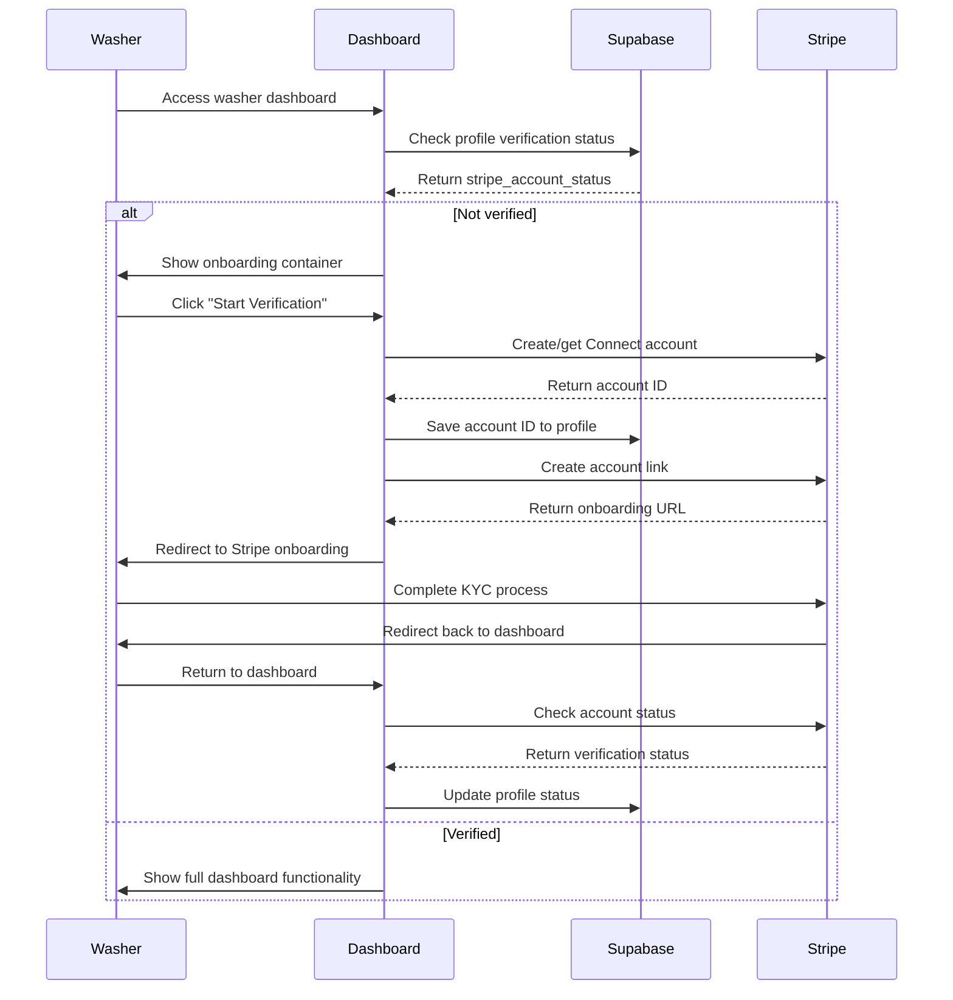

# Design Document

## Overview

This design implements a comprehensive washer verification system using Stripe Connect Express accounts for KYC compliance. The system creates a gated experience where new washers must complete Stripe's hosted onboarding flow before accessing core platform functionality. The design leverages existing Stripe Connect infrastructure while adding proper status tracking and UI components to guide washers through the verification process.

## Architecture

### High-Level Flow



### Verification Status States

The system tracks washers through these verification states:

1. **Unverified** (`stripe_account_status: null` or `'incomplete'`)
   - New washers who haven't started verification
   - Show onboarding container with call-to-action

2. **In Progress** (`stripe_account_status: 'pending'`)
   - Verification started but not completed
   - Show status message with option to continue

3. **Verified** (`stripe_account_status: 'complete'`)
   - Full KYC verification completed
   - Access to all washer functionality

4. **Requires Action** (`stripe_account_status: 'requires_action'`)
   - Additional information needed
   - Show message with link to continue verification

5. **Rejected** (`stripe_account_status: 'rejected'`)
   - Verification failed
   - Show error message and support contact

## Components and Interfaces

### 1. WasherVerificationContainer Component

**Purpose**: Main onboarding UI component displayed to unverified washers

**Props**:
```typescript
interface WasherVerificationContainerProps {
  user: User
  profile: Profile
  onVerificationStart: () => Promise<void>
}
```

**Features**:
- Prominent visual design with clear messaging
- Step-by-step verification process explanation
- Call-to-action button to start verification
- Progress indicators for multi-step process
- Error handling and retry mechanisms

### 2. VerificationStatusBanner Component

**Purpose**: Shows current verification status for washers in progress

**Props**:
```typescript
interface VerificationStatusBannerProps {
  status: StripeAccountStatus
  accountId?: string
  onContinueVerification?: () => Promise<void>
}
```

**Features**:
- Dynamic messaging based on verification status
- Action buttons for continuing incomplete verification
- Visual status indicators (pending, requires action, etc.)

### 3. Enhanced Washer Layout

**Modifications to existing `app/washer/layout.tsx`**:
- Add verification status checking logic
- Conditionally render verification container vs. full dashboard
- Implement access control for unverified washers

### 4. Stripe Connect Service Layer

**New service functions in `lib/stripe/actions.ts`**:

```typescript
// Get current Stripe account status
export async function getStripeAccountStatus(accountId: string): Promise<{
  status: string
  requirements?: any
  capabilities?: any
}>

// Check if washer can access functionality
export async function canAccessWasherFeatures(userId: string): Promise<boolean>

// Handle verification completion callback
export async function handleVerificationCallback(
  userId: string, 
  accountId: string
): Promise<void>
```

## Data Models

### Profile Table Updates

The existing `profiles` table already contains the necessary fields:
- `stripe_account_id`: Stores the Stripe Connect account ID
- `stripe_account_status`: Tracks verification status

**Status Values**:
- `null` or `'incomplete'`: Not started or incomplete
- `'pending'`: Verification in progress
- `'complete'`: Fully verified and active
- `'requires_action'`: Additional information needed
- `'rejected'`: Verification failed

### Verification Audit Log (Optional Enhancement)

For compliance and debugging, consider adding a verification log table:

```sql
CREATE TABLE washer_verification_log (
  id UUID PRIMARY KEY DEFAULT gen_random_uuid(),
  user_id UUID REFERENCES profiles(id),
  stripe_account_id TEXT,
  status TEXT NOT NULL,
  previous_status TEXT,
  requirements JSONB,
  created_at TIMESTAMP WITH TIME ZONE DEFAULT NOW()
);
```

## Error Handling

### Client-Side Error Handling

1. **Network Errors**: Retry mechanisms with exponential backoff
2. **Stripe API Errors**: User-friendly error messages with support contact
3. **Authentication Errors**: Redirect to sign-in with context preservation
4. **Validation Errors**: Clear field-level error messaging

### Server-Side Error Handling

1. **Stripe Connect API Failures**: Graceful degradation with error logging
2. **Database Update Failures**: Transaction rollback and retry logic
3. **Webhook Processing Errors**: Dead letter queue for failed events
4. **Rate Limiting**: Proper HTTP status codes and retry headers

### Error Recovery Flows

- **Incomplete Verification**: Allow users to resume where they left off
- **Expired Account Links**: Generate new onboarding links automatically
- **Account Suspension**: Clear messaging about next steps and support

## Testing Strategy

### Unit Tests

1. **Stripe Service Functions**:
   - Account creation and linking
   - Status checking and updates
   - Error handling scenarios

2. **React Components**:
   - Verification container rendering
   - Status banner display logic
   - User interaction handling

3. **Access Control Logic**:
   - Permission checking functions
   - Route protection mechanisms
   - Status-based feature gating

### Integration Tests

1. **Stripe Connect Flow**:
   - End-to-end account creation
   - Onboarding link generation
   - Status synchronization

2. **Database Operations**:
   - Profile updates
   - Status transitions
   - Audit logging

### End-to-End Tests

1. **Complete Verification Flow**:
   - New washer onboarding journey
   - Status updates and UI changes
   - Feature access after verification

2. **Error Scenarios**:
   - Failed verification handling
   - Network interruption recovery
   - Invalid state management

## Security Considerations

### Data Protection

- Stripe account IDs are stored securely in the database
- No sensitive KYC data is stored locally
- All verification data remains with Stripe

### Access Control

- Server-side verification of washer status
- Client-side UI is supplementary, not authoritative
- API endpoints protected with proper authentication

### Compliance

- GDPR compliance through Stripe's data handling
- PCI compliance maintained through Stripe Connect
- Audit trail for verification status changes

## Performance Considerations

### Caching Strategy

- Cache Stripe account status for short periods (5-10 minutes)
- Use Supabase real-time subscriptions for status updates
- Implement optimistic UI updates where appropriate

### API Rate Limiting

- Implement proper rate limiting for Stripe API calls
- Use exponential backoff for failed requests
- Queue non-critical status updates

### Database Optimization

- Index on `stripe_account_status` for quick filtering
- Optimize queries for washer dashboard loading
- Consider read replicas for status checking

## Monitoring and Analytics

### Key Metrics

- Verification completion rate
- Time to complete verification
- Drop-off points in the flow
- Error rates by type

### Logging

- Structured logging for all Stripe interactions
- User journey tracking through verification flow
- Error logging with context for debugging

### Alerts

- Failed verification webhook processing
- High error rates in verification flow
- Unusual patterns in verification attempts