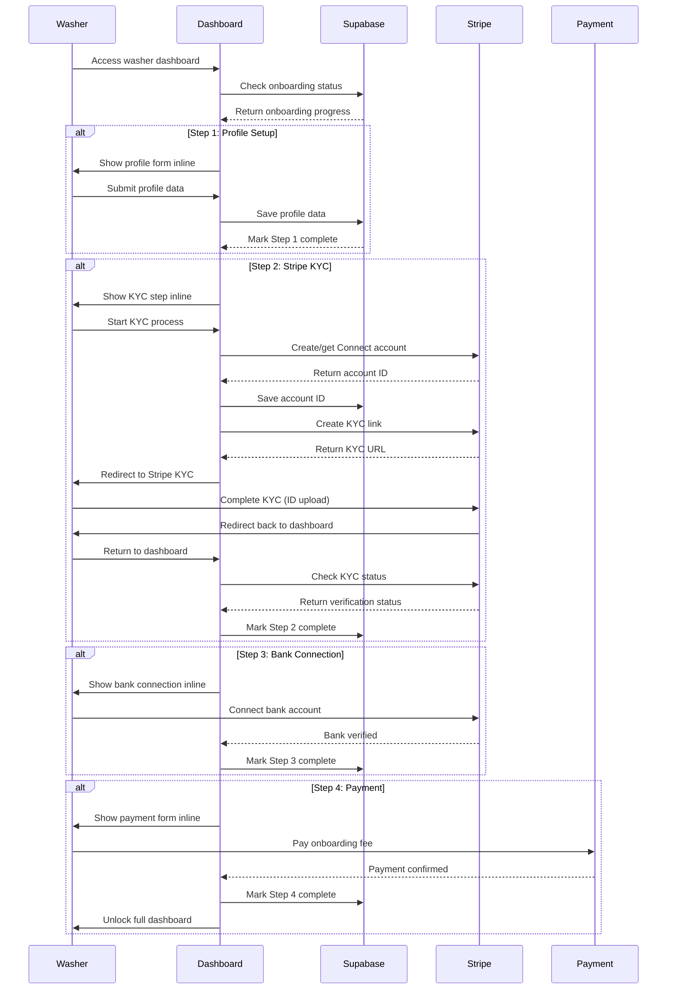

# Design Document

## Overview

This design implements a comprehensive 4-step washer onboarding system integrated directly into the dashboard overview. The system creates a gated experience where new washers see all dashboard features but in a locked/disabled state, with a prominent "Complete Your Setup" section guiding them through: (1) Profile/Service Setup, (2) Stripe Connect KYC verification, (3) Bank account connection, and (4) Onboarding fee payment. The entire process happens inline within the dashboard, ensuring washers never leave their dashboard context while completing onboarding.

## Architecture

### High-Level Flow



### Onboarding Status States

The system tracks washers through these 4-step onboarding states:

1. **Step 1: Profile Setup** (`onboarding_step: 1`)
   - Collect service area, availability, preferences
   - Store data in backend profile
   - Mark step complete when form submitted

2. **Step 2: Stripe KYC** (`onboarding_step: 2`)
   - Create Stripe Connect account
   - Complete KYC verification with ID uploads
   - Mark step complete when verification approved

3. **Step 3: Bank Connection** (`onboarding_step: 3`)
   - Connect bank account to Stripe
   - Verify bank account details
   - Mark step complete when bank verified

4. **Step 4: Payment** (`onboarding_step: 4`)
   - Pay £15 onboarding fee
   - Process payment confirmation
   - Mark step complete and unlock dashboard

5. **Complete** (`onboarding_complete: true`)
   - All 4 steps finished
   - Full dashboard access granted
   - All washer features unlocked

## Components and Interfaces

### 1. WasherOnboardingFlow Component

**Purpose**: Compact inline onboarding component integrated into dashboard overview

**Props**:
```typescript
interface WasherOnboardingFlowProps {
  user: User
  profile: Profile
  onStepComplete: (step: number, data: any) => Promise<void>
  onOnboardingComplete: () => Promise<void>
}
```

**Features**:
- Compact 4-step progress indicator
- Inline form components for each step
- Smooth transitions between steps
- Data persistence to backend
- Integration with Stripe Connect and payment processing

### 2. Enhanced Washer Dashboard Page

**Modifications to existing `app/washer/dashboard/page.tsx`**:
- Display all operational features in locked/disabled state
- Show prominent "Complete Your Setup" section
- Integrate WasherOnboardingFlow component inline
- Conditional rendering based on onboarding completion status

### 3. Onboarding Step Components

**Step 1: ProfileSetupStep**
```typescript
interface ProfileSetupStepProps {
  onNext: (data: ProfileData) => Promise<void>
  initialData?: ProfileData
}
```

**Step 2: StripeKYCStep**
```typescript
interface StripeKYCStepProps {
  onNext: () => Promise<void>
  onBack: () => void
  accountId?: string
}
```

**Step 3: BankConnectionStep**
```typescript
interface BankConnectionStepProps {
  onNext: () => Promise<void>
  onBack: () => void
  accountId: string
}
```

**Step 4: PaymentStep**
```typescript
interface PaymentStepProps {
  onComplete: () => Promise<void>
  onBack: () => void
  fee: number
}
```

### 4. Enhanced Service Layer

**New service functions in `lib/stripe/actions.ts`**:

```typescript
// Check onboarding completion status
export async function getOnboardingStatus(userId: string): Promise<{
  currentStep: number
  completedSteps: number[]
  isComplete: boolean
  profileData?: any
  stripeAccountId?: string
  bankConnected?: boolean
  paymentCompleted?: boolean
}>

// Save profile setup data
export async function saveProfileSetup(userId: string, data: ProfileData): Promise<void>

// Process onboarding fee payment
export async function processOnboardingPayment(userId: string): Promise<{
  success: boolean
  paymentIntentId?: string
}>

// Complete onboarding and unlock features
export async function completeOnboarding(userId: string): Promise<void>
```

## Data Models

### Profile Table Updates

The existing `profiles` table already contains the necessary fields:
- `stripe_account_id`: Stores the Stripe Connect account ID
- `stripe_account_status`: Tracks verification status

**Status Values**:
- `null` or `'incomplete'`: Not started or incomplete
- `'pending'`: Verification in progress
- `'complete'`: Fully verified and active
- `'requires_action'`: Additional information needed
- `'rejected'`: Verification failed

### Verification Audit Log (Optional Enhancement)

For compliance and debugging, consider adding a verification log table:

```sql
CREATE TABLE washer_verification_log (
  id UUID PRIMARY KEY DEFAULT gen_random_uuid(),
  user_id UUID REFERENCES profiles(id),
  stripe_account_id TEXT,
  status TEXT NOT NULL,
  previous_status TEXT,
  requirements JSONB,
  created_at TIMESTAMP WITH TIME ZONE DEFAULT NOW()
);
```

## Error Handling

### Client-Side Error Handling

1. **Network Errors**: Retry mechanisms with exponential backoff
2. **Stripe API Errors**: User-friendly error messages with support contact
3. **Authentication Errors**: Redirect to sign-in with context preservation
4. **Validation Errors**: Clear field-level error messaging

### Server-Side Error Handling

1. **Stripe Connect API Failures**: Graceful degradation with error logging
2. **Database Update Failures**: Transaction rollback and retry logic
3. **Webhook Processing Errors**: Dead letter queue for failed events
4. **Rate Limiting**: Proper HTTP status codes and retry headers

### Error Recovery Flows

- **Incomplete Verification**: Allow users to resume where they left off
- **Expired Account Links**: Generate new onboarding links automatically
- **Account Suspension**: Clear messaging about next steps and support

## Testing Strategy

### Unit Tests

1. **Stripe Service Functions**:
   - Account creation and linking
   - Status checking and updates
   - Error handling scenarios

2. **React Components**:
   - Verification container rendering
   - Status banner display logic
   - User interaction handling

3. **Access Control Logic**:
   - Permission checking functions
   - Route protection mechanisms
   - Status-based feature gating

### Integration Tests

1. **Stripe Connect Flow**:
   - End-to-end account creation
   - Onboarding link generation
   - Status synchronization

2. **Database Operations**:
   - Profile updates
   - Status transitions
   - Audit logging

### End-to-End Tests

1. **Complete Verification Flow**:
   - New washer onboarding journey
   - Status updates and UI changes
   - Feature access after verification

2. **Error Scenarios**:
   - Failed verification handling
   - Network interruption recovery
   - Invalid state management

## Security Considerations

### Data Protection

- Stripe account IDs are stored securely in the database
- No sensitive KYC data is stored locally
- All verification data remains with Stripe

### Access Control

- Server-side verification of washer status
- Client-side UI is supplementary, not authoritative
- API endpoints protected with proper authentication

### Compliance

- GDPR compliance through Stripe's data handling
- PCI compliance maintained through Stripe Connect
- Audit trail for verification status changes

## Performance Considerations

### Caching Strategy

- Cache Stripe account status for short periods (5-10 minutes)
- Use Supabase real-time subscriptions for status updates
- Implement optimistic UI updates where appropriate

### API Rate Limiting

- Implement proper rate limiting for Stripe API calls
- Use exponential backoff for failed requests
- Queue non-critical status updates

### Database Optimization

- Index on `stripe_account_status` for quick filtering
- Optimize queries for washer dashboard loading
- Consider read replicas for status checking

## Monitoring and Analytics

### Key Metrics

- Verification completion rate
- Time to complete verification
- Drop-off points in the flow
- Error rates by type

### Logging

- Structured logging for all Stripe interactions
- User journey tracking through verification flow
- Error logging with context for debugging

### Alerts

- Failed verification webhook processing
- High error rates in verification flow
- Unusual patterns in verification attempts