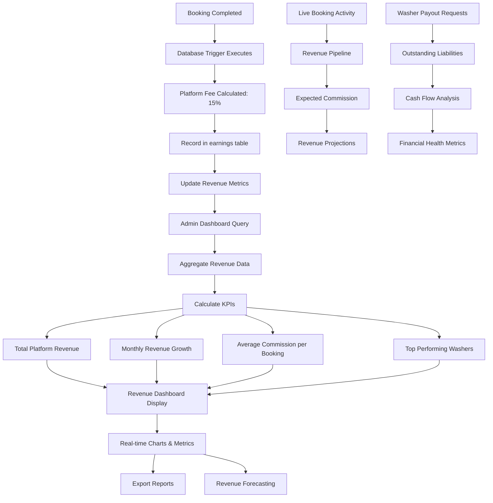

# Admin Revenue Dashboard Flow

This diagram shows how platform revenue (15% commission) is tracked and displayed in the admin dashboard for business intelligence and financial oversight.

## Revenue Tracking Flow



## Revenue Dashboard Features

### Core Metrics
- **Total Platform Revenue**: Lifetime commission earned
- **Monthly Recurring Revenue (MRR)**: Predictable monthly income
- **Average Revenue Per Booking**: Commission efficiency
- **Revenue Growth Rate**: Month-over-month growth percentage

### Financial Analytics
- **Commission Breakdown**: Revenue by service type
- **Geographic Revenue**: Earnings by location/postcode
- **Washer Performance**: Top earning washers by commission generated
- **Payment Status**: Confirmed vs pending commission

### Cash Flow Management
- **Available Balance**: Commission ready for company use
- **Outstanding Liabilities**: Pending washer payouts
- **Net Cash Position**: Available funds after liabilities
- **Payout Schedule**: Upcoming payment obligations

## Sample Revenue Dashboard Queries

### Daily Revenue Summary
```sql
SELECT 
    DATE(created_at) as date,
    COUNT(*) as bookings_completed,
    SUM(booking_total) as gross_revenue,
    SUM(platform_fee) as commission_earned,
    AVG(platform_fee) as avg_commission
FROM earnings 
WHERE created_at >= NOW() - INTERVAL '30 days'
GROUP BY DATE(created_at)
ORDER BY date DESC;
```

### Top Revenue Generating Washers
```sql
SELECT 
    p.first_name || ' ' || p.last_name as washer_name,
    COUNT(e.id) as bookings_completed,
    SUM(e.platform_fee) as commission_generated,
    AVG(e.booking_total) as avg_booking_value
FROM earnings e
JOIN profiles p ON e.washer_id = p.id
WHERE e.created_at >= NOW() - INTERVAL '30 days'
GROUP BY e.washer_id, washer_name
ORDER BY commission_generated DESC
LIMIT 10;
```

### Revenue Growth Analysis
```sql
SELECT 
    EXTRACT(YEAR FROM created_at) as year,
    EXTRACT(MONTH FROM created_at) as month,
    SUM(platform_fee) as monthly_commission,
    LAG(SUM(platform_fee)) OVER (ORDER BY EXTRACT(YEAR FROM created_at), EXTRACT(MONTH FROM created_at)) as prev_month,
    ROUND(
        ((SUM(platform_fee) - LAG(SUM(platform_fee)) OVER (ORDER BY EXTRACT(YEAR FROM created_at), EXTRACT(MONTH FROM created_at))) 
        / LAG(SUM(platform_fee)) OVER (ORDER BY EXTRACT(YEAR FROM created_at), EXTRACT(MONTH FROM created_at))) * 100, 2
    ) as growth_percentage
FROM earnings
GROUP BY year, month
ORDER BY year DESC, month DESC;
```

## Key Performance Indicators (KPIs)

| Metric | Formula | Target | Status |
|--------|---------|--------|--------|
| **Commission Rate** | Platform Fee / Booking Total | 15% | ✅ Automated |
| **Monthly Growth** | (Current Month - Previous Month) / Previous Month * 100 | >10% | 📊 Tracked |
| **Average Booking Value** | Total Revenue / Number of Bookings | £75+ | 📈 Monitored |
| **Washer Retention** | Active Washers This Month / Last Month | >95% | 🎯 Target |

## Financial Security Features

- **Automated Commission Calculation**: Cannot be bypassed or modified
- **Real-time Revenue Tracking**: Live updates as bookings complete
- **Immutable Financial Records**: All transactions permanently recorded
- **Audit Trail**: Complete history of all revenue generation
- **Fraud Detection**: Unusual pattern alerts and monitoring

## Revenue Reporting Capabilities

- **Daily/Weekly/Monthly Reports**: Automated financial summaries
- **Washer Performance Analysis**: Commission contribution rankings
- **Service Category Breakdown**: Revenue by service type
- **Geographic Analysis**: Regional performance metrics
- **Export Functionality**: CSV/Excel downloads for accounting
- **Tax Reporting**: Annual commission summaries for compliance 