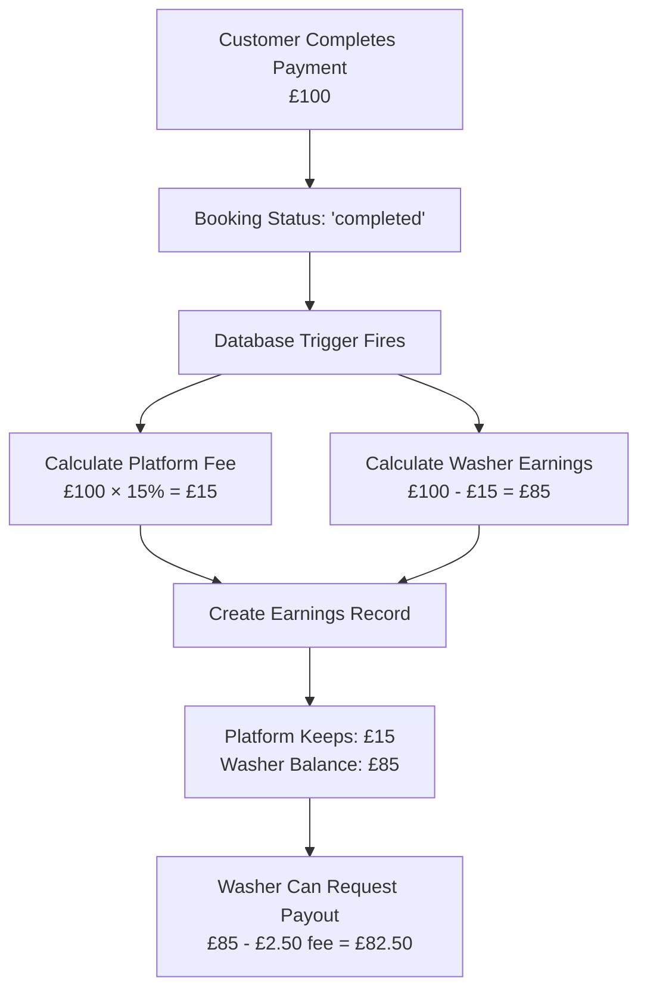

# Neighbourhood Wash - Commission & Payout Flow

## Platform Commission System (15%)

This diagram illustrates how the platform automatically takes its 15% commission on every completed booking and manages washer payouts.



## Key Financial Flows

### 1. Customer Payment → Platform

- Customer pays full amount (e.g., £100)
- Payment processed via Stripe
- Funds held by platform

### 2. Commission Calculation (Automatic)

- Trigger fires when booking marked 'completed'
- Platform fee: 15% of total
- Washer earnings: 85% of total

### 3. Earnings Recording

- **booking_total**: Full amount customer paid
- **platform_fee**: 15% commission
- **washer_earnings**: Amount credited to washer

### 4. Payout Process

- Washer requests withdrawal from dashboard
- £2.50 withdrawal fee applied
- Admin reviews and approves
- Funds transferred via Stripe Connect

## Example Calculations

| Booking Amount | Platform Fee (15%) | Washer Earns | After Withdrawal Fee |
| -------------- | ------------------ | ------------ | -------------------- |
| £50.00         | £7.50              | £42.50       | £40.00               |
| £100.00        | £15.00             | £85.00       | £82.50               |
| £150.00        | £22.50             | £127.50      | £125.00              |

## Security Features

- ✅ Database-level trigger (cannot be bypassed)
- ✅ Immutable earnings records
- ✅ Row-level security policies
- ✅ Admin approval for all payouts
- ✅ Full audit trail

## Database Implementation

The commission system is implemented via PostgreSQL trigger:

```sql
CREATE OR REPLACE FUNCTION public.create_earnings_for_completed_booking()
RETURNS TRIGGER AS $$
DECLARE
    platform_fee_rate NUMERIC := 0.15; -- 15% platform fee
    calculated_platform_fee NUMERIC;
    calculated_washer_earnings NUMERIC;
BEGIN
    -- Only create earnings when booking status changes to 'completed'
    IF NEW.status = 'completed' AND (OLD.status IS NULL OR OLD.status != 'completed') THEN
        -- Calculate fees
        calculated_platform_fee := NEW.total_price * platform_fee_rate;
        calculated_washer_earnings := NEW.total_price - calculated_platform_fee;

        -- Insert earnings record
        INSERT INTO public.earnings (
            booking_id,
            washer_id,
            booking_total,
            platform_fee,
            washer_earnings,
            status,
            made_available_at
        ) VALUES (
            NEW.id,
            NEW.washer_id,
            NEW.total_price,
            calculated_platform_fee,
            calculated_washer_earnings,
            'available',
            NOW()
        );
    END IF;

    RETURN NEW;
END;
$$ LANGUAGE plpgsql SECURITY DEFINER;
```

This ensures the platform commission is:

- Automatically calculated
- Immediately recorded
- Permanently stored
- Never skippable
