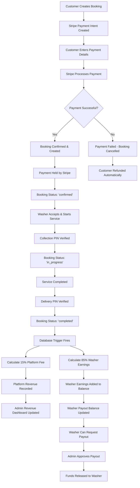

# Customer Payment Flow

This diagram shows how customer payments flow through the Neighbourhood Wash platform, from initial booking to platform revenue capture.

## Payment Flow Diagram

## Payment Breakdown Examples

| Booking Amount | Stripe Fee (~3%) | Net Received | Platform Fee (15%) | Washer Earns |
|----------------|------------------|--------------|-------------------|--------------|
| £50.00         | £1.50           | £48.50       | £7.50             | £42.50       |
| £100.00        | £3.00           | £97.00       | £15.00            | £85.00       |
| £150.00        | £4.50           | £145.50      | £22.50            | £127.50      |

## Security Features

- **Payment Security**: All payments processed through Stripe's secure infrastructure
- **Two-Factor Verification**: PIN codes required for both collection and delivery
- **Automatic Fee Calculation**: Database triggers prevent commission bypass
- **Immutable Records**: All financial transactions are permanently recorded
- **Admin Oversight**: Manual approval required for all payouts

## Technical Implementation

- **Stripe Payment Intents**: Secure payment processing with 3D Secure support
- **Database Triggers**: Automatic calculation of fees when bookings complete
- **Real-time Updates**: Live balance tracking for washers
- **Audit Trail**: Complete transaction history with timestamps
- **Error Handling**: Comprehensive payment failure management 