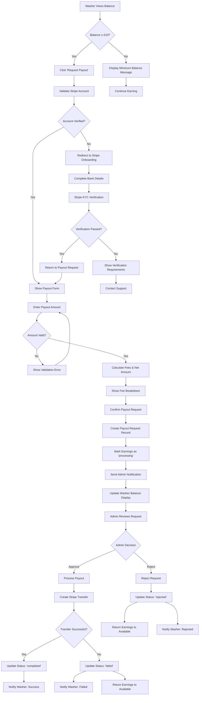
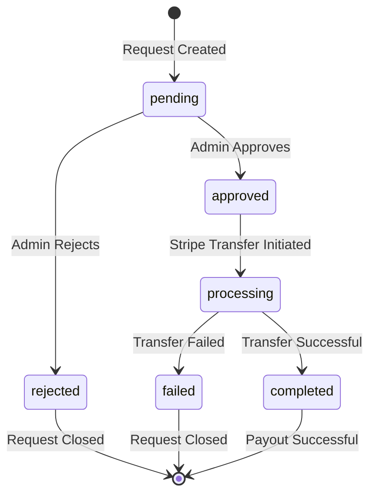

# Payout Request Workflow

This diagram shows the detailed workflow for washer payout requests, including validation, admin approval, and fund transfer processes.

## Payout Request Flow

## Payout Request States

## Admin Approval Interface

### Review Criteria
- **Washer Verification Status**: Stripe account fully verified
- **Earnings Legitimacy**: All earnings from completed bookings
- **Account Standing**: No recent disputes or issues
- **Minimum Thresholds**: Request meets minimum requirements
- **Fraud Indicators**: No suspicious activity patterns

### Admin Actions Available
| Action | Description | Effect |
|--------|-------------|--------|
| **Approve** | Process payout request | Initiates Stripe transfer |
| **Reject** | Deny payout request | Returns earnings to available balance |
| **Request Info** | Ask for additional details | Pauses request for clarification |
| **Flag Account** | Mark for investigation | Prevents future payouts until resolved |

## Validation Rules

### Amount Validation
- **Minimum**: £10.00
- **Maximum**: Available balance
- **Increments**: £0.01 precision
- **Fee Calculation**: £2.50 flat fee per request

### Account Validation
- **Stripe Connection**: Active Express account required
- **Bank Details**: Verified bank account connected
- **Identity Verification**: KYC documents approved
- **Tax Information**: W-9/W-8 forms completed (if applicable)

### Security Checks
- **Rate Limiting**: Maximum 3 requests per week
- **Fraud Detection**: Pattern analysis on request timing
- **Account Age**: Minimum 7 days since first earning
- **Completion Rate**: Minimum booking completion percentage

## Notification System

### Washer Notifications
- **Request Submitted**: Confirmation with reference number
- **Under Review**: Admin reviewing request status
- **Approved**: Payout processing notification
- **Rejected**: Reason for rejection with next steps
- **Completed**: Funds transferred successfully
- **Failed**: Transfer issue with retry options

### Admin Notifications
- **New Request**: Immediate notification to admin team
- **Verification Required**: Additional documentation needed
- **Transfer Failed**: Stripe transfer error details
- **Suspicious Activity**: Potential fraud flag alerts

## Error Handling

### Common Error Scenarios
1. **Insufficient Balance**: User tries to withdraw more than available
2. **Unverified Account**: Stripe account incomplete or suspended
3. **Transfer Failure**: Bank account issues or Stripe errors
4. **Duplicate Request**: Multiple simultaneous payout attempts
5. **Rate Limiting**: Too many requests in short timeframe

### Recovery Procedures
- **Automatic Retry**: Failed transfers retry after 24 hours
- **Manual Investigation**: Admin review for complex issues
- **Support Escalation**: Customer service intervention
- **Refund Protection**: Earnings always returned if payout fails 