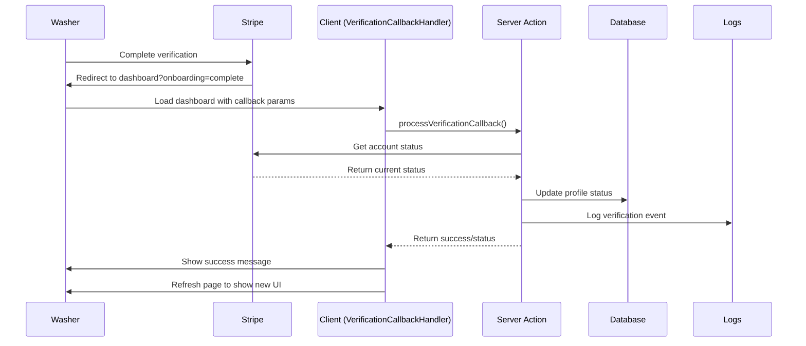

# Verification Callback Handling System

## Overview

This document describes the verification callback handling system implemented for Task 7 of the washer Stripe KYC onboarding feature. The system handles the return flow when washers complete (or attempt to complete) Stripe Connect verification and ensures their status is properly synchronized with the application database.

## Requirements Implemented

The system implements the following requirements:

- **2.4**: WHEN the washer completes the Stripe onboarding THEN they SHALL be redirected back to their dashboard
- **2.5**: WHEN the washer returns from Stripe onboarding THEN the system SHALL update their verification status
- **6.1**: WHEN a washer's Stripe Connect status changes THEN the system SHALL update the profile record accordingly
- **6.2**: WHEN verification status is updated THEN the system SHALL log the change for audit purposes

## Architecture

### Components

1. **Server Actions** (`lib/stripe/actions.ts`)
   - `handleVerificationCallback()` - Core callback processing logic
   - `processVerificationCallback()` - Client-facing server action
   - `syncVerificationStatus()` - Manual status synchronization
   - `logVerificationEvent()` - Audit logging helper

2. **Client Component** (`components/washer/VerificationCallbackHandler.tsx`)
   - Detects callback URL parameters
   - Calls server actions to process callbacks
   - Provides user feedback during processing
   - Handles errors gracefully

3. **Integration Points**
   - Washer layout (`app/washer/layout.tsx`)
   - Washer dashboard (`app/washer/dashboard/page.tsx`)

### Flow Diagram



## Implementation Details

### Server-Side Processing

#### handleVerificationCallback()

The core callback processing function that:

1. **Validates inputs** - Ensures user ID and account ID are valid
2. **Fetches user profile** - Gets current cached status from database
3. **Queries Stripe API** - Gets real-time verification status
4. **Updates database** - Synchronizes status if changed
5. **Logs events** - Creates audit trail for compliance
6. **Returns results** - Provides status and change information

Key features:
- Comprehensive error handling with typed error responses
- Retry logic for API failures
- Fallback to cached status when Stripe API is unavailable
- Structured logging for audit compliance
- Performance monitoring with timing

#### processVerificationCallback()

Client-facing server action that:

1. **Authenticates user** - Ensures valid session
2. **Validates permissions** - Confirms user is a washer
3. **Delegates to core handler** - Calls `handleVerificationCallback()`
4. **Generates user messages** - Creates appropriate feedback based on status
5. **Handles errors gracefully** - Provides meaningful error messages

### Client-Side Processing

#### VerificationCallbackHandler Component

React component that:

1. **Detects callback parameters** - Monitors URL for `onboarding=complete` or `connect_success=true`
2. **Shows processing UI** - Displays loading state during callback processing
3. **Calls server actions** - Invokes `processVerificationCallback()`
4. **Provides user feedback** - Shows success/error messages with appropriate styling
5. **Cleans up URL** - Removes callback parameters after processing
6. **Refreshes UI** - Triggers page refresh to show updated verification status

Features:
- Toast-style notifications with appropriate icons
- Auto-refresh after successful processing
- Error recovery with retry mechanisms
- Clean URL management

### Logging and Audit Trail

The system implements comprehensive logging for compliance:

#### Log Structure
```typescript
{
  timestamp: string,
  userId: string,
  accountId: string,
  eventType: 'callback_processed' | 'status_updated' | 'verification_completed' | 'verification_failed',
  previousStatus?: StripeAccountStatus,
  currentStatus: StripeAccountStatus,
  statusChanged: boolean,
  error?: string,
  requirements?: any
}
```

#### Event Types
- `callback_processed` - Every callback attempt (success or failure)
- `status_updated` - When verification status changes
- `verification_completed` - When status becomes 'complete'
- `verification_failed` - When errors occur during processing

### Error Handling

The system implements multi-layer error handling:

1. **Input Validation** - Validates all parameters before processing
2. **API Error Handling** - Graceful handling of Stripe API failures
3. **Database Error Handling** - Proper handling of database update failures
4. **Network Error Handling** - Retry logic for network issues
5. **User Error Communication** - Meaningful error messages for users

#### Error Types
- `validation_error` - Invalid input parameters
- `auth_error` - Authentication/authorization failures
- `stripe_error` - Stripe API errors
- `network_error` - Network connectivity issues
- `unknown_error` - Unexpected errors

### Integration Points

#### Washer Layout Integration

The callback handler is integrated at the layout level to ensure it works across all washer pages:

```tsx
<Suspense fallback={null}>
  <VerificationCallbackHandler />
</Suspense>
```

This ensures that washers returning from Stripe verification are handled regardless of which washer page they land on.

#### Dashboard Integration

Additional integration in the dashboard page provides redundancy and specific handling for the main landing page.

## Testing

The system includes comprehensive unit tests covering:

- Input validation
- Error handling scenarios
- Audit logging functionality
- Integration with mocked dependencies

Test file: `lib/stripe/__tests__/verification-callback.test.ts`

## Security Considerations

1. **Server-Side Validation** - All status updates are validated server-side
2. **Authentication Required** - Only authenticated washers can trigger callbacks
3. **Role Validation** - Only users with 'washer' role can process callbacks
4. **Audit Trail** - All verification events are logged for compliance
5. **Error Information** - Sensitive error details are not exposed to clients

## Performance Considerations

1. **Async Processing** - All operations are asynchronous to avoid blocking
2. **Timing Monitoring** - Processing time is tracked and logged
3. **Fallback Mechanisms** - Cached status used when API calls fail
4. **Efficient Updates** - Only updates database when status actually changes

## Monitoring and Observability

The system provides comprehensive monitoring through:

1. **Structured Logging** - All events logged in JSON format with `[VERIFICATION_AUDIT]` prefix
2. **Performance Metrics** - Processing time tracked for all operations
3. **Error Tracking** - All errors logged with context and stack traces
4. **Status Transitions** - All status changes logged with before/after values

## Future Enhancements

Potential improvements for production deployment:

1. **Database Audit Table** - Store audit logs in dedicated database table
2. **External Logging Service** - Send logs to CloudWatch, Datadog, etc.
3. **Webhook Integration** - Handle Stripe webhooks for real-time updates
4. **Rate Limiting** - Implement rate limiting for callback processing
5. **Metrics Dashboard** - Create dashboard for verification completion rates

## Usage Examples

### Manual Status Sync

```typescript
// Manually sync a user's verification status
const result = await syncVerificationStatus(userId)
if (result.success) {
  console.log(`Status synced: ${result.data.previousStatus} -> ${result.data.currentStatus}`)
}
```

### Error Handling

```typescript
const result = await processVerificationCallback()
if (!result.success) {
  switch (result.error?.type) {
    case 'auth_error':
      // Handle authentication error
      break
    case 'stripe_error':
      // Handle Stripe API error
      break
    default:
      // Handle other errors
  }
}
```

## Conclusion

The verification callback handling system provides a robust, secure, and auditable way to handle washer verification status updates when they return from Stripe Connect onboarding. The system ensures compliance with all specified requirements while providing excellent error handling and user experience.