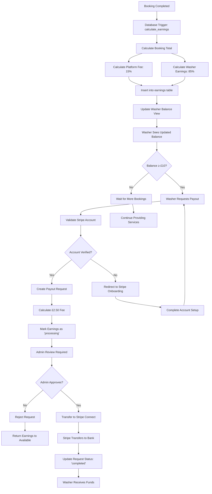

# Washer Earnings Flow

This diagram shows how washer earnings are calculated, tracked, and paid out through the Neighbourhood Wash platform.

## Earnings Flow Diagram



## Earnings Calculation Example

### Booking: £100 Laundry Service

```
Customer Payment:     £100.00
Platform Fee (15%):   £15.00
Washer Gross Earning: £85.00

At Payout Request:
Available Balance:    £85.00
Payout Fee:          £2.50
Net Payout:          £82.50
```

## Balance States

| State | Description | Action Available |
|-------|-------------|------------------|
| **Available** | Ready for payout request | ✅ Can request payout |
| **Processing** | Payout request pending admin approval | ⏳ Waiting for approval |
| **Completed** | Successfully paid out | ✅ Funds transferred |

## Real-time Balance Tracking

The `washer_balances` view provides real-time calculations:

```sql
-- Available: earnings not in processing/completed payouts
-- Processing: earnings in pending payout requests  
-- Total: lifetime earnings from all completed bookings
```

## Payout Requirements

- **Minimum Balance**: £10.00
- **Verified Stripe Account**: Required for payouts
- **Admin Approval**: Manual review for security
- **Fee Structure**: £2.50 flat fee per payout
- **Processing Time**: 1-3 business days after approval

## Security Features

- **FIFO Processing**: Oldest earnings paid out first
- **Immutable Records**: Cannot modify completed earnings
- **Admin Oversight**: All payouts require manual approval
- **Audit Trail**: Complete history of all transactions
- **Account Verification**: Stripe KYC/AML compliance required 